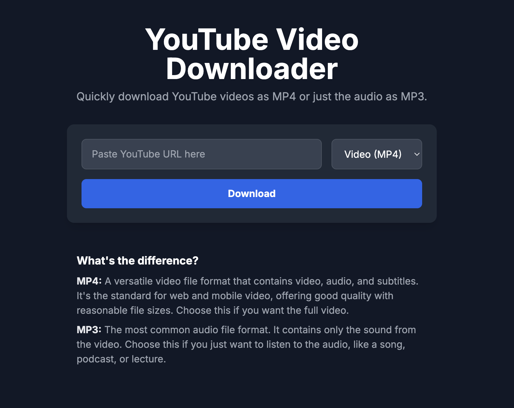

# YouTube Downloader
A simple Python script to download either mp3s or mp4s from YouTube.



## Table of Contents
- [Installation](#installation)
- [Usage](#usage)
- [Running the Application](#running-the-application)
- [Contributing](#contributing)
- [License](#license)

## Installation
1. **Clone the repository:**
   ```bash
   git clone https://github.com/yourusername/youtubeDL.git
   cd youtubeDL
   ```

2. **Create a virtual environment (optional but recommended):**
   ```bash
   # For macOS/Linux
   python3 -m venv venv
   source venv/bin/activate

   # For Windows
   python -m venv venv
   .\venv\Scripts\activate
   ```

3. **Install the required dependencies:**
   ```bash
   pip install -r requirements.txt
   ```

## Usage
1. **Run the application:**
   You can start the Flask web application using the provided shell script:
   ```bash
   ./run.sh
   ```

2. **Access the application:**
   Open your web browser and go to `http://127.0.0.1:5000`.

3. **Download a video:**
   - Paste the YouTube URL into the input field.
   - Select the desired format (MP3 or MP4).
   - Click the "Download" button.

## Running the Application
### Using the Shell Script
The `run.sh` script automates the setup and execution of the web application. It includes commands to create a virtual environment, install dependencies, and run the Flask server.

### Manual Execution
If you prefer to run the application manually, you can do so with the following command:
```bash
python src/web.py
```

## Contributing
Contributions are welcome! Please open an issue or submit a pull request for any improvements or bug fixes.

## License
This project is licensed under the MIT License. See the LICENSE file for more details.
